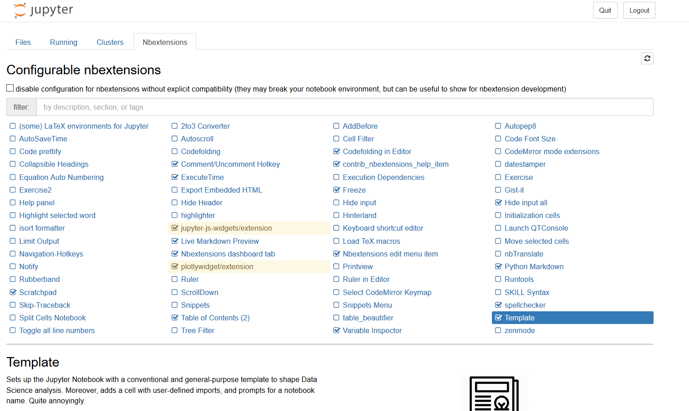
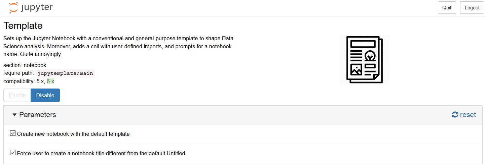

# Jupyter template

[](https://www.tidyverse.org/lifecycle/#experimental)


[](https://pepy.tech/project/jupytemplate)
[](https://pepy.tech/project/jupytemplate/month)
[](https://saythanks.io/to/donlelef)


A simple template for jupyter notebooks.

The extension sets up any new Jupyter Notebook 
with a conventional and general-purpose
template to shape Data Science analysis.

The template includes conventional sections,
like *Data Import*, *Processing* and *References*,
as well as code to perform common operations, like
importing and configuring charting libraries. 

Moreover, it prompts for a meaningful name whenever
you try and save a notebook called 'Untitled'. 

But don't worry, you can disable
this one.


## Motivation
Jupyter notebooks are awesome tools: they enable fast 
prototyping and ease result sharing. However, due to 
their flexibility, they are prone to be abused. 

In order to help Data Scientist keep their notebooks 
clean, a reasonably flexible yet conventional template
may help. Moreover, such a template may be also a 
productivity tool, which speeds up common setup,
such as library import.

## Quick start
It is not mandatory, but you can install the full set of Jupyter 
extensions.
```shell
pip install jupyter_contrib_nbextensions
jupyter contrib nbextension install --user
```
Feel free to visit [their repository](https://github.com/ipython-contrib/jupyter_contrib_nbextensions)
for more information.

Now you can install the package:
```shell
pip install jupytemplate
```
Then, you have to install the javascript files from 
the Python package in a conventional jupyter directory:
```shell
jupyter nbextension install --py jupytemplate --sys-prefix
```
Finally, you may want to enable the extension:
```shell
jupyter nbextension enable jupytemplate/main --sys-prefix
```
You can easily enable, disable or configure the extension
by using the [nbextension_configurator](https://github.com/Jupyter-contrib/jupyter_nbextensions_configurator)
server extension, as shown below.







## Changing the template
Template location can be found by running:   
```python
import jupytemplate
print(jupytemplate.get_template_path())
```
Of course, you can modify the template as you like, do not 
modify the file name `template.ipynb`.  
After editing the template, run:
```shell
jupyter nbextension install --py jupytemplate --sys-prefix
jupyter nbextension enable jupytemplate/main --sys-prefix
```
to make changes effective.

## References
Please consider reading the following resources for
a more comprehensive understanding:
- Will Kohersen, [Set Your Jupyter Notebook up Right with this Extension](https://towardsdatascience.com/set-your-jupyter-notebook-up-right-with-this-extension-24921838a332)
- Will Kohersen, [How to Write a Jupyter Notebook Extension](https://towardsdatascience.com/how-to-write-a-jupyter-notebook-extension-a63f9578a38c)
- Will Kohersen, [Setup extension](https://github.com/WillKoehrsen/Data-Analysis/tree/master/setup)